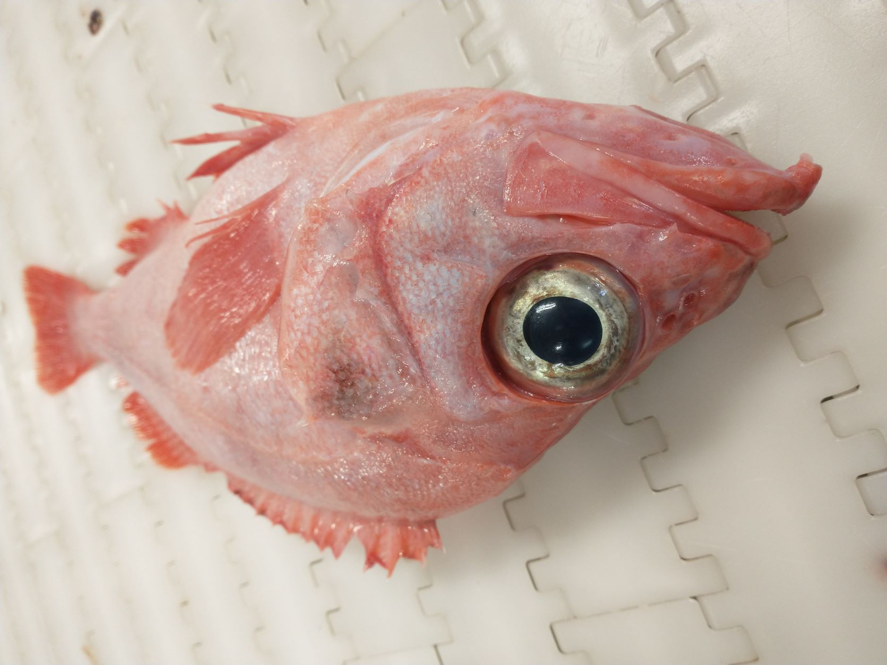

# Redfish Workshop 2023

A workshop to evaluate and synthesize methods for species identification of redfish (*Sebastes mentella* and *S. norvegicus*) in the Northeast Atlantic Ocean (Greenland and Iceland waters)

## Date

**13-15 March 2023**

## Venue

Greenland Institute of Natural Resources (GINR), Kivioq 2, 3900 Nuuk, Greenland.

We will meet in three main localities:

- the meeting room "Bjørnerum" or a meeting room in Pikialaarfik (TBC) for discussions and presentations
- the fisheries laboratory/wet lab in Pikialaarfik (TBC) for practical work
- the cafeteria (TBC) for coffee/lunch breaks

## Introduction and aim

The overall main goals of the workshop are to:

- assess whether redfish specimens are identified similarly to species level between the different countries
- assess how high error rates in redfish specimen identification are
- agree on reliable characters to be used for redfish specimen identification
- agree on possible procedures to account for potential errors in the future

## Information and material

All information about this workshop will be available here on [this website](https://github.com/notothen/redfish-ws23).

We can also compile presentations, data, links to relevant publications, etc. here.

We will work with about 250 frozen redfish specimens from the 2022 survey season. These specimens will be identified to species level genetically. However, we will not reveal the "true" genetic species identity (and neither where the fish are from, which depth they where caught at etc.) until the end of the workshop. The main idea is that all workshop participants identify all 250 fish and we can then compare how well this works. In addition, we may record some photographic, morphological and/or morphometric measurements in order to gain some data about which morphological characters are most useful for quick identification.

## Program

The program is still subject to change!

### Monday 13th March 2023

Arrival in Nuuk (participants from DEU scheduled to arrive around noon - participants from ISL arrive earlier). Depending on the arrival timing we may start with some introductions & discussions in the afternoon.

### Tuesday 14th March 2023

**08:00** Welcome and introduction

- description of workshop background and goals (Henrik)
- introduction round of all participants
- practicalities: venue, working rooms, lunch, coffee, accommodation
- preparations for practical session

**09:00** Practical session I

- identification of freshly thawed redfish specimens
- everyone should identify as many fish as possible using the same procedure and criteria as on a survey
- in addition, we may record pictures and possibly some morphometric measurements of the fish
- coffee break around 10

**12:00** Lunch

**13:00** Practical session II

- continue with specimen identification
- questionnaire (?) about characters used for specimen identification

**16:00** End of practical session

- time for Henrik, Daniel & Søren to process results
- also time for collaboration discussions, side meetings, evening program, ...

### Wednesday 15th March 2023

**8:00** Free time

- additional time for Henrik, Daniel & Søren to process results
- possible time for further collaboration discussions, side meetings, ...

**10:00** Coffee

**10:15** Presentation of results

- comparison of obtained IDs with genetic IDs
- comparison of these results depending on institute, fish size, true species ID etc.
- this session could be interesting for additional staff of GINR-FiSk (e.g. people who do not participate in the practical session but are still curious about the results)

**12:00** Lunch

**13:00** Discussion about perspectives for redfish identification

- short presentation by Kristján, Henrik and by someone from TI(?)
- integration of survey data from Greenland, Iceland, Germany possible?
- "best practices" for specimen identification?
- next steps?
- this session is mainly for attendees from DEU & ISL and staff from GRL working with redfish assessment

**16:00-18:00** End of workshop

- joint dinner?

### Thursday 16th March

Departure from Nuuk (participants from ISL)
/
Free day or extra time for discussion (participants from DEU)

## Participants

- Annika Elsheimer, Thünen Institute of Sea Fisheries, Germany (TI)
- Christian Schulte, TI
- Matthias Bernreuther, TI
- Kristján Kristinsson, Marine and Freshwater Research Institute, Iceland (MFRI)
- Sif Gudmundsdottir, MFRI
- Daniel Estévez-Barcia, Greenland Institute of Natural Resources, Greenland (GN)
- Søren Post, GN
- Henrik Christiansen, GN
- AnnDorte Burmeister, GN
- Tanja Buch, GN
- Anja Retzel, GN
- Sofie Ruth Jeremiassen, GN
- Nanette Hammeken, GN
- and more?

and possibly joining remotely:
- Karl-Michael Werner (?), TI
- Julius Nielsen (?), GN
